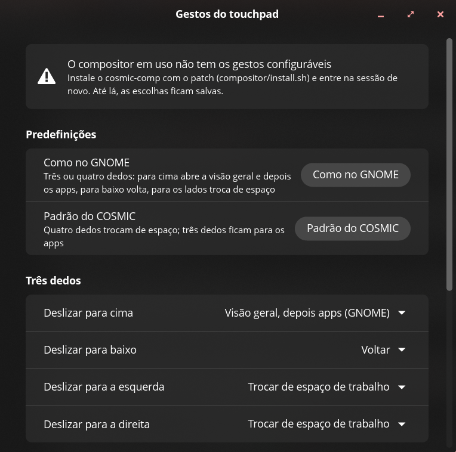

# Gestos do touchpad para o COSMIC

Os gestos do GNOME no COSMIC, e um app para escolher o que cada gesto faz.

O COSMIC 1.8 só troca de espaço de trabalho com quatro dedos para os lados; três dedos
não fazem nada (nem chegam aos apps), e não há como configurar. Isto são duas partes:

- **`compositor/`**: um patch para o `cosmic-comp` que lê os gestos de uma configuração
  e os faz, e outro que deixa as animações das janelas como as do GNOME, com scripts
  para compilar, instalar e voltar ao original;
- **o app "Gestos do touchpad"**: escolhe o que cada gesto faz, e mostra se o compositor
  em uso tem o patch.



## O que dá para fazer

Para três e quatro dedos, deslizando para cima, para baixo e para os lados:

| Ação | |
| --- | --- |
| Trocar de espaço de trabalho | acompanhando os dedos, na direção em que os espaços estão (horizontal ou vertical) |
| Visão geral, depois apps | como no GNOME: abre os espaços de trabalho; de novo, a biblioteca de apps |
| Espaços de trabalho, Biblioteca de apps, Iniciador | abrem ou fecham cada um |
| Voltar | fecha a biblioteca de apps, o iniciador ou os espaços de trabalho |
| Executar comando | qualquer comando |
| Nada | com todas as direções em Nada, o gesto vai para o app sob o cursor |

O padrão é o do GNOME: três ou quatro dedos para cima abrem a visão geral e depois os
apps, para baixo voltam, para os lados trocam de espaço. "Padrão do COSMIC" volta ao
original (só quatro dedos para os lados).

As ações que abrem algo esperam os dedos andarem um pouco (60 px), para um toque à toa não
abrir nada. A visão geral do COSMIC é um programa à parte (`cosmic-workspaces`): ela abre
quando o gesto passa desse ponto, sem crescer junto com os dedos como no GNOME.

## Animações

Como no GNOME (os tempos e as curvas são os do `gnome-shell`):

| | COSMIC 1.8 | Com o patch |
| --- | --- | --- |
| Abrir janela | aparece de uma vez | cresce do meio da borda de baixo e aparece aos poucos (150 ms) |
| Fechar janela | some de uma vez | encolhe um pouco e some aos poucos (150 ms) |
| Minimizar e restaurar | 320 ms, curva simétrica | 400 ms, rápido no começo e devagar no fim |
| Maximizar e encaixar | 200 ms, curva simétrica | 250 ms, desacelerando |
| Trocar de espaço pelo teclado | 200 ms, curva simétrica | 250 ms, desacelerando |

Abrir vale para janelas flutuantes (o padrão do COSMIC); no modo lado a lado as janelas
continuam entrando como antes. Para fechar, o compositor guarda uma imagem da janela no
momento em que o app a fecha e é ela que some.

## Instalar

O compositor (precisa de `sudo` para trocar o `/usr/bin/cosmic-comp`, e de Rust e das
bibliotecas de desenvolvimento do `cosmic-comp`):

```sh
compositor/install.sh
```

Ele baixa o `cosmic-comp` da mesma versão do sistema, aplica os patches, compila, guarda o
original como `cosmic-comp.orig` e põe o novo no lugar. Saia da sessão e entre de novo.

Se a sessão não abrir: Ctrl+Alt+F3, entre, e rode `sudo mv /usr/bin/cosmic-comp.orig
/usr/bin/cosmic-comp` (ou `sudo dnf reinstall cosmic-comp`). `compositor/restore.sh`
faz o mesmo de dentro da sessão.

Uma atualização do `cosmic-comp` pelo sistema troca o compositor de volta pelo original:
rode `compositor/install.sh` de novo (para uma versão nova, o patch precisa ser
atualizado; o app avisa quando o compositor em uso não tem os gestos).

O app:

```sh
./install.sh            # em ~/.local
```

## Como funciona

A configuração fica em `~/.config/cosmic/io.github.DrakRosmann.CosmicGestures/v1/bindings`
(RON), escrita pelo app e lida pelo compositor, que a recarrega ao mudar. O patch
(`compositor/cosmic-comp-1.8.0-gestures.patch`) troca o trecho em que o `cosmic-comp`
decidia os gestos de quatro dedos (`src/input/mod.rs`) pela leitura dessa configuração;
a troca de espaço continua sendo a do COSMIC, que acompanha os dedos, e as outras ações
usam os mesmos comandos dos atalhos de teclado (`Super+W`, `Super+A`…).

## In English

GNOME's touchpad gestures for COSMIC: a patch for `cosmic-comp` 1.8.0 that reads which
three- and four-finger swipes do what (switch workspace following the fingers, overview
then app library, app library, launcher, go back, run a command), scripts to build,
install and restore it, and an app to set the gestures. Another patch makes window
animations GNOME's: windows open growing from their bottom middle and close shrinking
and fading, and minimizing, maximizing and switching workspaces use GNOME's timing and
curves.

## Licença

GPL-3.0-only, como o `cosmic-comp`.
